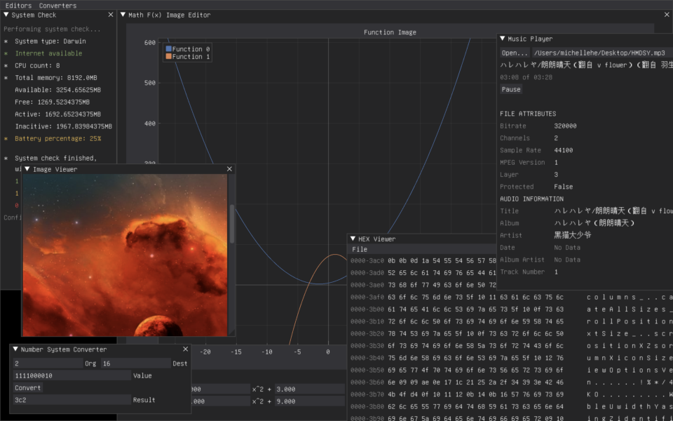

DearPyGui è una potente libreria che ci permette di creare Interfacce Grafiche(GUI) in [Python](https://avid3855894.altervista.org/strumenti-per-programmare-al-meglio-in-python/). È progettato per essere semplice da utilizzare e offre una vasta gamma di funzionalità per la creazione di interfacce grafiche interattive e professionali. Con DearPyGui, puoi creare finestre, aggiungere widget come pulsanti, caselle di testo, grafici e altro ancora. Puoi personalizzare l'aspetto della tua interfaccia utilizzando stili predefiniti o creando i tuoi stili personalizzati. Inoltre, DearPyGui offre funzionalità avanzate come il drag-and-drop, la gestione degli eventi, la serializzazione dei layout e la compatibilità con la libreria NumPy per la visualizzazione dei dati.Una delle caratteristiche distintive di DearPyGui è la sua velocità. Grazie all'implementazione ottimizzata, DearPyGui è in grado di gestire un gran numero di widget e di mantenere un'interattività fluida anche con interfacce grafiche complesse.

DearPyGui è ampiamente utilizzato in diversi campi, come lo sviluppo di strumenti di visualizzazione dati, applicazioni di editing e creazione di strumenti di automazione personalizzati.

Dai un occhiata alla wiki sul [sito ufficiale](https://github.com/hoffstadt/DearPyGui)

<figure>



<figcaption>

_Esempio molto avanzato di cosa si può fare con DearPygui_

</figcaption>

</figure>

Di seguito troverai un tutorial introduttivo su DearPyGui, una libreria di interfaccia grafica utente (GUI) per Python. Questo tutorial ti guiderà attraverso i passaggi fondamentali per creare una finestra, aggiungere widget e gestire gli eventi. Prima di iniziare, assicurati di avere DearPyGui installato correttamente nel tuo ambiente Python con questi comandi

```
pip install dearpygui
oppure
pip3 install dearpygui
```

Inizia importando la libreria dearpygui.dearpygui come dpg. Successivamente, definiamo una funzione di callback **on\_button\_clicked** che verrà chiamata quando il pulsante viene premuto. All'interno del contesto creato con **dpg.create\_context()**, creiamo un viewport con il titolo "DearPyGui Tutorial" e chiamiamo **dpg.setup\_dearpygui()** per configurare DearPyGui.

```
import dearpygui.dearpygui as dpg

def save_callback():
    print("Save Clicked")

dpg.create_context()
dpg.create_viewport()
dpg.setup_dearpygui()

with dpg.window(label="Esempio"):
    dpg.add_text("Hello world")
    dpg.add_button(label="Save", callback=save_callback)
    dpg.add_input_text(label="string")
    dpg.add_slider_float(label="float")

dpg.show_viewport()
dpg.start_dearpygui()
dpg.destroy_context()
```

in questo programma stiamo definendo una funzione di callback del tasto(ciò che viene chiamato quando viene premuto) che stampa una stringa nella console.

In seguito dopo aver chiamato le tre funzioni di setup obbligatorie in ogni programma Dearpygui, apriamo una finestra chiamata "Esempio" in cui ci aggiungiamo del testo, un tasto, uno spazio per l'input del testo ed uno slider per inserire dei numeri in formato float.

Questo è stato facile, ora vediamo di qualcosa più complesso.

```
import dearpygui.dearpygui as dpg
dpg.create_context()

M = 1
C = 0


def generate_data(m: float, c: float):
    data_x, data_y = [], []
    for x in range(-100, 100):
        data_x.append(x)
        data_y.append(m*x + c)
    return data_x, data_y


def update_plot():
    data_x, data_y = generate_data(dpg.get_value(
        "m_slider"), dpg.get_value("c_slider"))
    dpg.configure_item('line', x=data_x, y=data_y)


with dpg.window():
    with dpg.plot(label="y = mx + c", height=400, width=500):
        xaxis = dpg.add_plot_axis(dpg.mvXAxis, label="x")
        yaxis = dpg.add_plot_axis(dpg.mvYAxis, label="y")
        data_x, data_y = generate_data(M, C)
        dpg.add_line_series(data_x, data_y, tag='line', parent=yaxis)

    dpg.add_slider_float(label="m", tag="m_slider", default_value=M,
                         min_value=0, max_value=10, callback=update_plot)
    dpg.add_slider_float(label="c", tag="c_slider", default_value=C,
                         min_value=-50, max_value=50, callback=update_plot)

dpg.create_viewport(width=900, height=600, title='Updating plot data')
dpg.setup_dearpygui()
dpg.show_viewport()
dpg.start_dearpygui()
dpg.destroy_context()
```

Questo script utilizza DearPyGui per creare un grafico di una linea retta (y = mx + c) che può essere aggiornato dinamicamente tramite slider.Il codice inizia creando un contesto DearPyGui con dpg.create\_context(). Quindi, viene definita una funzione generate\_data() che genera coppie di valori x e y per una linea retta con coefficienti m e c specificati.

Successivamente, viene definita una funzione update\_plot() che viene chiamata ogni volta che i valori degli slider m e c vengono modificati. Questa funzione richiama generate\_data() con i valori correnti degli slider e aggiorna i dati della serie del grafico utilizzando dpg.configure\_item().Nel corpo principale dello script, viene creato un oggetto finestra con un grafico all'interno. Viene inizialmente creato un grafico di una linea retta utilizzando i valori M e C predefiniti. Viene inoltre creato un asse x e un asse y per il grafico.Successivamente, vengono aggiunti due slider float per i valori m e c, con valori predefiniti M e C. Ogni volta che viene modificato uno degli slider, viene chiamata la funzione update\_plot() per aggiornare dinamicamente i dati del grafico.Infine, il contesto e il viewport di DearPyGui vengono creati, e la libreria viene avviata con dpg.start\_dearpygui().

Alla chiusura della finestra, il contesto viene distrutto con dpg.destroy\_context().Eseguendo questo script, verrà visualizzata una finestra con un grafico della linea retta y = mx + c. Puoi utilizzare gli slider per modificare i valori di m e c e il grafico verrà aggiornato di conseguenza.Spero che questo esempio sia utile per capire come aggiornare dinamicamente i dati di un grafico con DearPyGui!

In conclusione, DearPyGui è una libreria di interfaccia grafica potente e veloce per Python, che offre una vasta gamma di funzionalità per creare interfacce grafiche professionali. Spero che questa introduzione ti abbia dato un'idea di cosa aspettarti da DearPyGui e ti abbia ispirato ad esplorare ulteriormente questa libreria per lo sviluppo delle tue applicazioni GUI.
